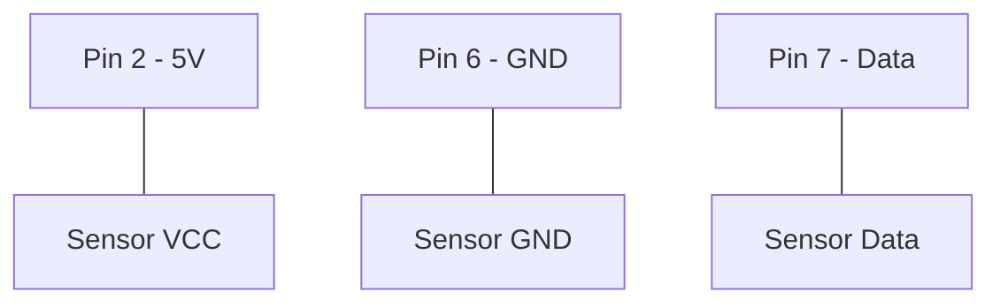

# DHT11 Temperature & Humidity Sensor

This tutorial demonstrates how to read data from a DHT11 sensor using the `dht11` library.

## 🔌 Circuit Diagram

## 🚀 Setup
Ensure you have the `dht11` Python library installed on your Raspberry Pi.
