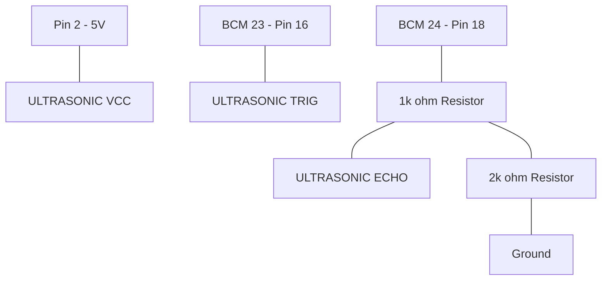

# HC-SR04 Ultrasonic Sensor with LED Feedback

This tutorial measures distance and provides visual feedback using a Matplotlib-based GUI that changes color based on proximity.

## 🔌 Circuit Diagram

> [!CAUTION]
> **Voltage Divider Required:** The HC-SR04 Echo pin outputs 5V, but the Raspberry Pi inputs only handle 3.3V. You must use resistors to step down the voltage.

## 🚀 Setup
- **Library:** `RPi.GPIO`, `matplotlib`
- **Numbering:** This script uses `GPIO.BCM` numbering.
