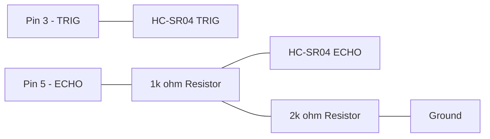
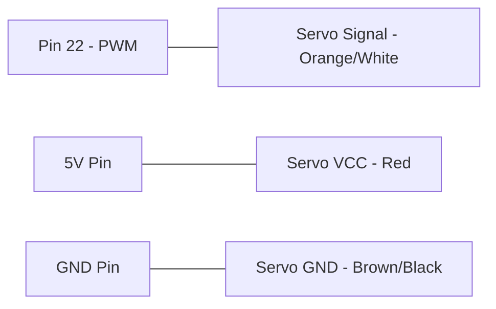

# Raspberry Pi Hardware Tutorials

This section contains hands-on tutorials for interfacing sensors, actuators, and communication modules with the Raspberry Pi.

## 📌 Master Pinout Reference

To ensure your circuits work correctly, please refer to the table below. Note the difference between **Physical (BOARD)** numbering and **Broadcom (BCM)** numbering.

| Component | Function | Physical Pin (BOARD) | BCM Pin |
| :--- | :--- | :--- | :--- |
| **DHT11 Sensor** | Data | Pin 7 (Recommended) | GPIO 4 |
| **Ultrasonic (HC-SR04)** | Trigger (TRIG) | Pin 3 | GPIO 2 |
| **Ultrasonic (HC-SR04)** | Echo (ECHO) | Pin 5 | GPIO 3 |
| **Servo Motor** | PWM Signal | Pin 22 | GPIO 25 |
| **I2C Devices (VR)** | SDA (Data) | Pin 3 | GPIO 2 |
| **I2C Devices (VR)** | SCL (Clock) | Pin 5 | GPIO 3 |

> [!WARNING]
> **Pin Collision:** Some tutorials use Pin 3 and Pin 5. You cannot run the I2C VR Remote and the Ultrasonic sensor on the same pins simultaneously without a multiplexer.

---

## ⚡ Hardware Safety & Interfacing

### 1. Power Levels
- **3.3V vs 5V:** Raspberry Pi GPIO pins operate at **3.3V**. Connecting a 5V signal directly to a pin (e.g., from an Ultrasonic Echo pin) can **permanently damage your Pi**. 
- **Recommendation:** Always use a **Voltage Divider** (1kΩ and 2kΩ resistors) for 5V sensor outputs.

### 2. GPIO Cleanup
Always ensure your code ends with `GPIO.cleanup()`. This resets the pins to a safe input state, preventing accidental shorts in your next project.

---

## 🎨 Circuit Diagrams (Mermaid)

### 1. Ultrasonic Sensor Connection

### 2. Servo Motor Connection

---

## 🚀 Repository Roadmap
- [DHT11/](DHT11/): Humidity and Temperature sensing.
- [HCSO4_ULTRASONIC_LED/](HCSO4_ULTRASONIC_LED/): Distance measurement with matplotlib visualization.
- [SERVO/](SERVO/): Standard servo motor control using PWM.
- [ULTRASONIC_THINKSPEAK/](ULTRASONIC_THINKSPEAK/): IoT integration sending data to the cloud.
- [VR_REMOTE/](VR_REMOTE/): Advanced I2C interfacing for remote control.
- [**Modern_gpiozero/**](Modern_gpiozero/): (New) Best-practice examples using the modern Python library.