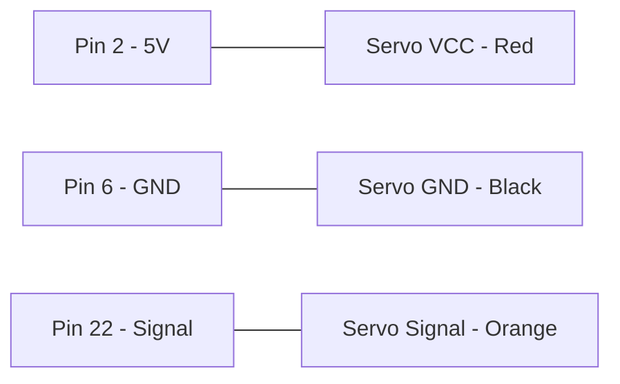

# Servo Motor Control

This tutorial demonstrates how to control a standard servo motor using PWM signals.

## 🔌 Circuit Diagram

## 🚀 Note
This script uses `GPIO.BOARD` numbering for the PWM signal.
