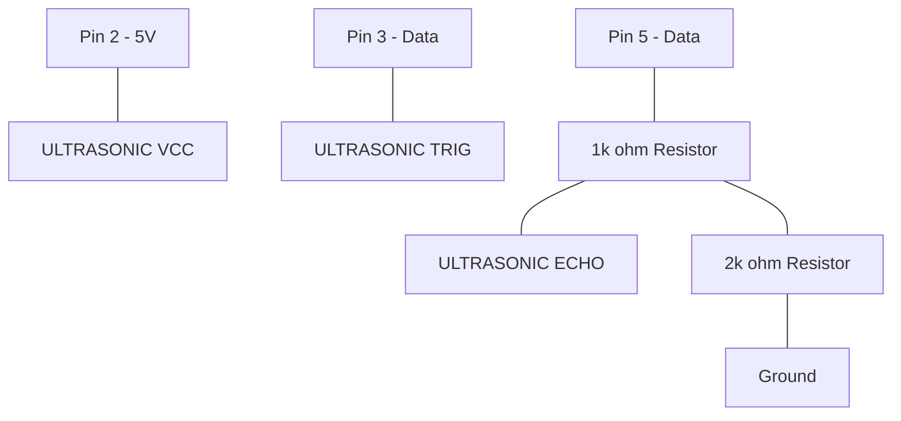

# ThinkSpeak IoT Ultrasonic Tracker

This tutorial measures distance and automatically uploads the data to your ThinkSpeak cloud dashboard for remote monitoring.

## 🔌 Circuit Diagram

> [!CAUTION]
> **Voltage Divider Required:** The HC-SR04 Echo pin outputs 5V. Use resistors to protect your Pi's 3.3V GPIO input.

## 🚀 Setup
- **API Key:** Make sure to replace `YOUR_API_KEY_HERE` in the script with your Write API Key.
- **Numbering:** This script uses `GPIO.BOARD` numbering.
